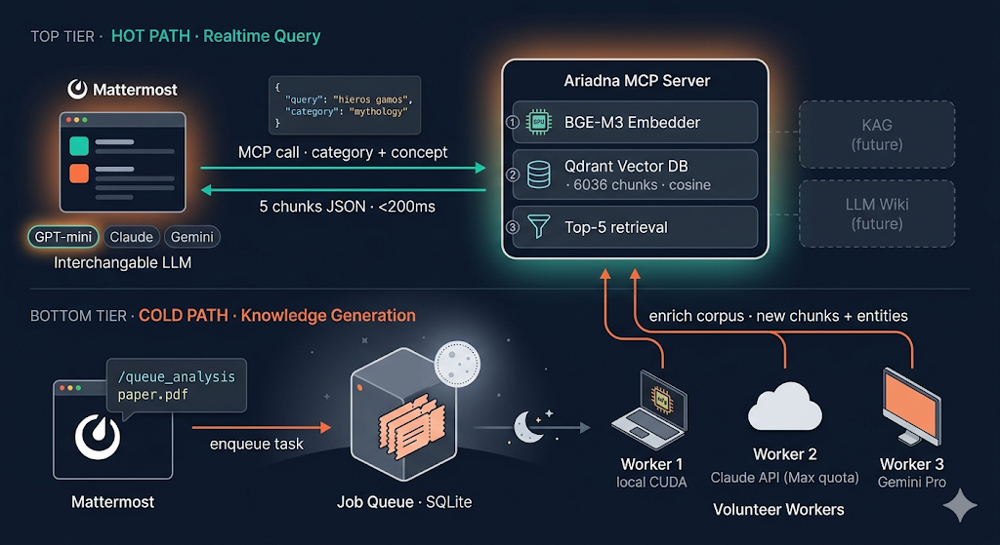

# Ariadna

> Hilo que guía por el laberinto del conocimiento acumulado.

Asistente conversacional con acceso a un corpus de vídeos analíticos via **Model Context Protocol (MCP)**. El usuario interactúa con cualquier LLM (GPT, Claude, Gemini, modelo local) en Mattermost; al fondo, un servidor MCP en Python resuelve consultas semánticas sobre el corpus indexado.



## Qué es y qué no es

- ✅ **Es:** un servidor MCP read-only que expone un corpus saneado a cualquier LLM compatible
- ✅ **Es:** una arquitectura de dos flujos — consulta hot (RAG) y generación cold (workers asíncronos)
- ✅ **Es:** una base sobre la que construir KAG, LLM Wiki, entity index sin reescribir el corpus
- ❌ **No es:** un wrapper alrededor de un LLM concreto — el LLM es intercambiable
- ❌ **No es:** una solución end-to-end — necesitas un cliente MCP (ej. Mattermost AI plugin)

## Arquitectura en una frase

**El corpus es el activo, MCP es el contrato, el LLM es reemplazable.** Detalle en [docs/ARCHITECTURE.md](docs/ARCHITECTURE.md).

## Capas de evolución (Karpathy "LLM Wiki")

```
LAYER 0  —  Raw chunks (Qdrant + BGE-M3): fuente de verdad indexada
LAYER 1  —  Wiki estructurada en markdown (wiki/): páginas por entidad/concepto/autor/obra
LAYER 2  —  Grafo emergente: el conjunto de wikilinks ES el grafo, sin BD aparte
LAYER 3  —  Scope.md: contrato editorial entre corpus crudo y wiki (qué entra y por qué)
```

Cada capa se añade encima sin romper las anteriores, y se accede vía el mismo cliente MCP. El extractor LLM (sub-agente in-loop con scope.md como guía) construye y mantiene la wiki sin firma humana en el camino feliz. Roadmap completo en [docs/PHASES.md](docs/PHASES.md). Refactor reciente del pipeline en [docs/PIPELINE_REFACTOR_2026_05_02.md](docs/PIPELINE_REFACTOR_2026_05_02.md).

## Estado del proyecto

| Fase | Estado |
|---|---|
| **A.1** — Layer 0 RAG dense + MCP server + integración Mattermost | ✅ Cerrada (2026-04-23) |
| **A.2** — Sparse BM25, threshold, reranker cross-encoder, retrieval indirecto vía citations | ✅ Reranker activo. RRF dense+sparse probado y descartado (no aporta sobre BGE-M3 dense-solo). |
| **B** — **Wiki estructurada con KG emergente** + pipeline push-based Karpathy | 🟢 Operativo — **104 páginas** (45 conceptos, 10 autores, 28 obras, 21 syntheses), 5 pilares editoriales (liberalismo, filosofía, psicología cognitiva, mitología, neurociencia), 35% del corpus procesado |
| **C** — Despliegue producción (Hetzner, URL fija) | Pendiente |
| **D** — Cold path con voluntarios + ingesta multi-formato | Pendiente |

Estado vivo en [docs/NEXT_SESSION.md](docs/NEXT_SESSION.md).

## Requisitos

- Python 3.13+
- GPU con CUDA recomendable para indexado rápido (BGE-M3 funciona en CPU pero más lento)
- Qdrant embebido en disco via `qdrant-client` (no requiere servidor separado)
- Corpus fuente con estructura `<categoría>/<vídeo>/{summary.md, meta.json}`

## Instalación

```bash
git clone https://github.com/Sangaroth/ariadna.git
cd ariadna
uv venv
source .venv/bin/activate
uv pip install -e ".[dev]"
```

## Uso

### 1. Indexar el corpus

```bash
ariadna-index --source /path/to/corpus/playlists
```

Genera embeddings con BGE-M3 y los persiste en `data/qdrant/` (gitignored).

### 2. Ejecutar el servidor MCP

```bash
./scripts/run_server.sh
# o equivalente:
ariadna-server --host 0.0.0.0 --port 8765 --warm
```

### 3. Exponer al exterior (desarrollo)

```bash
./scripts/run_tunnel.sh   # ngrok http 8765
```

Para producción ver [docs/PHASES.md#fase-c--despliegue-producción-hetzner](docs/PHASES.md#fase-c--despliegue-producción-hetzner).

### 4. Integrar con Mattermost

Guía paso a paso en [docs/INTEGRACION_MATTERMOST.md](docs/INTEGRACION_MATTERMOST.md). Resumen:

- Plugin **Agents v2.0.0-rc1+** (per-tool approval policy es bloqueante para UX)
- System Console → Agents → MCP Servers → Server URL: `https://<your-tunnel-or-domain>/mcp`
- Tools tab → política `Auto Run (DM)` en cada tool

### 5. Consultar desde CLI (sin Mattermost)

```bash
ariadna-search "que dice el canal sobre el hieros gamos"
```

O via HTTP al servidor ya corriendo (no bloquea Qdrant):

```bash
curl -s -X POST http://127.0.0.1:8765/mcp \
  -H "Content-Type: application/json" \
  -H "Accept: application/json, text/event-stream" \
  -d '{"jsonrpc":"2.0","id":1,"method":"tools/call","params":{"name":"search_corpus","arguments":{"query":"sombra junguiana","top_k":3}}}'
```

## Tools MCP expuestas

- **`search_corpus(query, top_k=5, category=None, playlist=None)`** — búsqueda híbrida con reranker cross-encoder + retrieval indirecto vía wiki citations (dos pasadas: exact `(video_id, ts)` + same-video fallback con score multiplier). Devuelve `{wiki_pages, raw_chunks, retrieval_metadata}` con `mode_recommended`. Wiki entries llevan `match_via ∈ {semantic, citation, citation_video, both}`. Schema autoritativo: [docs/RESPONSE_FLOW.md §10](docs/RESPONSE_FLOW.md#10-schema-autoritativo-vigente-desde-2026-04-30)
- **`get_wiki_page(page_id)`** — devuelve la página wiki completa (frontmatter + body) por `page_id`
- **`get_video_summary(video_id)`** — chunks completos de un vídeo en orden cronológico
- **`list_videos(category=None, playlist=None)`** — listado filtrado de vídeos del corpus

## Estructura del repositorio

```
ariadna/
├── pyproject.toml
├── README.md
├── LICENSE
├── ariadna/                          — código fuente
│   ├── config.py                     — paths, modelo, Qdrant settings
│   ├── parsers.py                    — markdown → Chunk dataclass
│   ├── embeddings.py                 — wrapper BGE-M3
│   ├── storage.py                    — wrapper Qdrant
│   ├── reranker.py                   — cross-encoder rerank
│   ├── search.py                     — Searcher con retrieval indirecto + 2-pass citations
│   ├── build_index.py                — CLI de indexado
│   └── mcp_server.py                 — FastMCP server
├── scripts/
│   ├── extract_video_themes.py       — extractor LLM con sub-agente in-loop (Karpathy)
│   ├── apply_pending_updates.py      — aplica diff-style ops con anchor literal único
│   ├── compile_wiki_pages.py         — sync shadow_wiki → wiki real
│   ├── build_wiki_db.py              — genera data/wiki.db (citations table)
│   ├── scan_mentions_ledger.py       — recovery de referencias débiles previas
│   ├── run_server.sh                 — arranca MCP server
│   └── run_tunnel.sh                 — expone via ngrok
├── wiki/                             — base de conocimiento (104 pages)
│   ├── concepts/                     — 45 conceptos arquetípicos / cognitivos / etc.
│   ├── authors/                      — 10 autores canónicos
│   ├── entities/works/               — 28 obras (libros, películas, juegos)
│   ├── synthesis/                    — 21 páginas de síntesis (cross-cuts del canal)
│   └── _meta/
│       ├── scope.md                  — contrato editorial v0.3 (3ª capa Karpathy)
│       ├── canonical_whitelist.json  — figuras canónicas con auto_promote
│       ├── relation_types.json       — tipos de relations[] permitidos
│       └── extraction_runs/          — JSONs commiteados (memoria operativa LLM)
├── docs/
│   ├── PIPELINE_REFACTOR_2026_05_02.md — refactor v0.3 completo (16 secciones)
│   ├── ARCHITECTURE.md               — argumentación de diseño
│   ├── EXTRACTION_PIPELINE.md        — pipeline push-based base
│   ├── PHASES.md                     — roadmap por capas
│   ├── NEXT_SESSION.md               — estado vivo del proyecto
│   ├── INTEGRACION_MATTERMOST.md     — guía cliente
│   └── RESPONSE_FLOW.md              — schema autoritativo MCP
├── tests/
├── data/qdrant/                      — vector DB persistente (gitignored)
└── data/wiki.db                      — SQLite citations table (gitignored, regenerable)
```

## Documentación

- **[docs/ARCHITECTURE.md](docs/ARCHITECTURE.md)** — argumentación de diseño: por qué desacoplar MCP del LLM, por qué dos flujos, por qué la taxonomía importa más que la tecnología
- **[docs/TAXONOMY_PROPOSAL.md](docs/TAXONOMY_PROPOSAL.md)** — schema multi-fuente (papers PDF, vídeos URL, libros, podcasts, threads, ...), separación sources/chunks, autores con ORCID/Wikidata, taxonomía OpenAlex Topics como fuente de verdad, ingesta con [markitdown](https://github.com/microsoft/markitdown) + Crossref/arXiv. Doc vivo
- **[docs/WIKI_GENERATION.md](docs/WIKI_GENERATION.md)** — pipeline completo de la wiki estructurada con KG emergente (Fase B): generador de páginas markdown con frontmatter, wikilinks tipados, validación automática, loop iterativo humano-en-el-bucle
- **[docs/RESPONSE_FLOW.md](docs/RESPONSE_FLOW.md)** — flujo de respuesta MCP con 4 ejemplos estructurados completos. Demuestra cómo opera el modo híbrido (wiki + raw) en escenarios reales con datos JSON, costes y latencias concretas. Validación previa a la implementación de Fase B
- **[docs/PHASES.md](docs/PHASES.md)** — roadmap por fases (A → A.2 → B → C → D), criterios para saltar de una a otra
- **[docs/NEXT_SESSION.md](docs/NEXT_SESSION.md)** — estado vivo del proyecto, decisiones tomadas, bugs conocidos, comandos útiles
- **[docs/run_pipeline.md](docs/run_pipeline.md)** — pipeline técnico end-to-end (corpus → parser → embedding → Qdrant → MCP → LLM)
- **[docs/INTEGRACION_MATTERMOST.md](docs/INTEGRACION_MATTERMOST.md)** — guía paso a paso de integración con el cliente Mattermost
- **[docs/PIPELINE_REFACTOR_2026_05_02.md](docs/PIPELINE_REFACTOR_2026_05_02.md)** — refactor v0.3 del pipeline de extracción: sub-agente in-loop, scope reformado (5 pilares), schema-tolerant, auto-promote thesis, lane recommended_reference, protocolo de propagación con 3 comandos
- **[docs/EXTRACTION_PIPELINE.md](docs/EXTRACTION_PIPELINE.md)** — pipeline push-based base (pre-v0.3)
- **[wiki/README.md](wiki/README.md)** — base de conocimiento navegable (104 pages)

## Licencia

[MIT](LICENSE).
